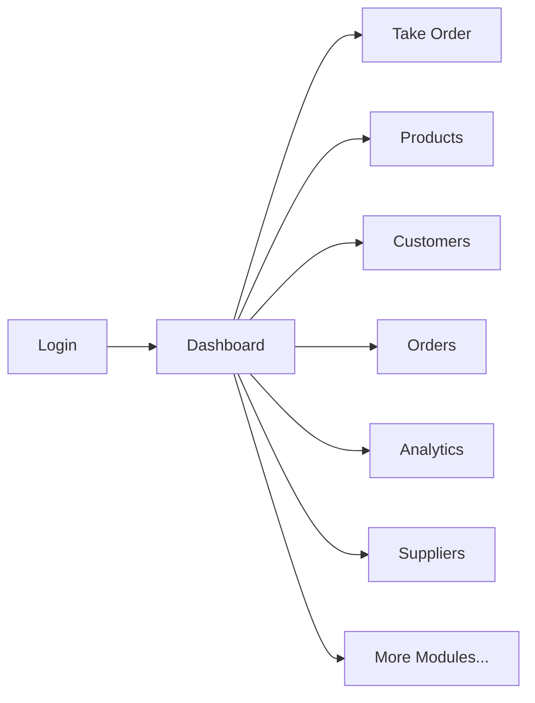
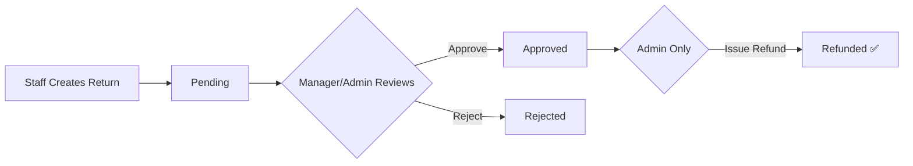
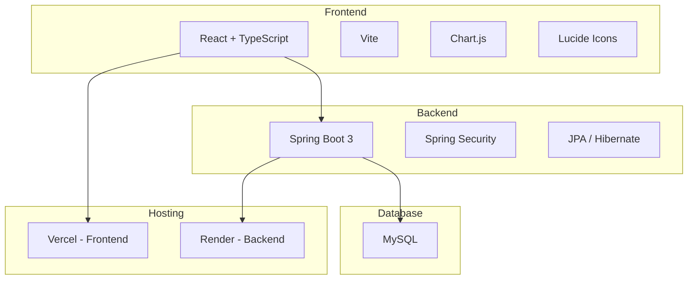

# 🏪 RetailStore — Management System Documentation

> **Live URL**: [retail-store-gilt.vercel.app](https://retail-store-gilt.vercel.app)
> **Backend API**: Hosted on Render | **Frontend**: Hosted on Vercel
> **Built by**: Raja Adhikary

---

## 📋 What Is This?

RetailStore is a **full-stack retail management web application** that helps store owners, managers, and staff manage their entire retail business from one dashboard — including products, orders, customers, suppliers, inventory, returns, promotions, and analytics.



---

## 🔐 1. Login & Signup

### How to Login
1. Open the website
2. Enter your **email** and **password**
3. Click **Sign In**

### Default Accounts

| Role | Email | Password |
|------|-------|----------|
| 🔴 Admin | `admin@retailstore.com` | `password123` |
| 🟡 Manager | `manager@retailstore.com` | `password123` |
| 🔵 Staff | `staff@retailstore.com` | `password123` |

### How to Sign Up (New User)
1. Click **"Sign Up"** on the login page
2. Choose your role:
   - **Admin** → Creates a new store automatically
   - **Manager / Staff** → Select an existing store from dropdown
3. Fill in name, email, password
4. Click **Create Account**

> [!IMPORTANT]
> Manager and Staff accounts need **Admin approval** before they can log in. The admin sees pending requests in **Signup Requests** page.

---

## 🛡️ 2. Role-Based Access

Not all users can see all pages. Here's what each role gets:

| Feature | 🔴 Admin | 🟡 Manager | 🔵 Staff |
|---------|----------|-----------|---------|
| Dashboard | ✅ | ✅ | ✅ |
| Products | ✅ Edit/Delete | ✅ Edit | ✅ View Only |
| Customers | ✅ Edit/Delete | ✅ View | ✅ View |
| Orders | ✅ | ✅ | ✅ |
| Take Order (POS) | ✅ | ✅ | ✅ |
| Analytics | ✅ | ✅ | ❌ |
| Dues & Payments | ✅ | ✅ | ❌ |
| Customer Lookup | ✅ | ✅ | ✅ |
| Inventory Alerts | ✅ | ✅ | ❌ |
| Returns & Refunds | ✅ Approve + Refund | ✅ Approve | ✅ Create Only |
| User Management | ✅ | ❌ | ❌ |
| Suppliers & POs | ✅ | ❌ | ❌ |
| Promotions | ✅ | ❌ | ❌ |
| Audit Logs | ✅ | ❌ | ❌ |
| Signup Requests | ✅ | ❌ | ❌ |
| Export CSV | ✅ | ✅ | ❌ |

---

## 📊 3. Dashboard

The first page you see after login. Shows:
- **Total Sales** — Sum of all order amounts
- **Total Orders** — Number of orders placed
- **Total Customers** — Number of registered customers
- **Monthly Revenue** — Current month's earnings
- **Recent Orders** — Quick table of the latest orders

---

## 🛒 4. Take Order (POS)

This is where you create new orders for customers.

### Steps to Create an Order:
1. Go to **Take Order** from the sidebar
2. **Search products** using the search bar (top-left)
3. **Click a product** to add it to the cart
4. Use **+** / **−** buttons to adjust quantity
5. **Select a customer**:
   - Search existing customer by name
   - Or type a name manually
   - Or click **"Add New Customer"** to create one
6. *(Optional)* **Apply a coupon code** — type the code and click "Check & Apply"
7. *(Optional)* **Use Loyalty Points** — if the customer has points, click "Apply"
8. Choose **Payment Method**: Cash / Card / UPI
9. Click **"Complete Order"**

> [!TIP]
> When you select an existing customer, the refund amount auto-fills if you later need to return the order.

---

## 📦 5. Products

Manage your product catalog.

| Action | How |
|--------|-----|
| **View all products** | Products are displayed in a table with name, category, price, stock |
| **Add new product** | Click **"Add Product"** → fill form → Save |
| **Edit product** | Click the ✏️ edit icon on any row |
| **Delete product** | Click the 🗑️ delete icon (Admin only) |
| **Search** | Use the search bar to filter by name |
| **Export CSV** | Click **"Export CSV"** button (Admin/Manager) |

---

## 👥 6. Customers

Manage your customer database.

| Action | How |
|--------|-----|
| **View customers** | Table shows name, email, phone, city, join date |
| **Add customer** | Click **"Add Customer"** → fill form → Save |
| **Edit** | Click ✏️ icon |
| **Delete** | Click 🗑️ icon (Admin only) |
| **Search** | Search by name or phone |

---

## 📋 7. Orders

Track and manage all orders.

| Action | How |
|--------|-----|
| **View orders** | Table shows Order ID, customer, date, items, total, status |
| **Filter by status** | Use the status dropdown: Pending / Processing / Shipped / Delivered / Completed / Cancelled |
| **Change status** | Select a new status from the dropdown in any row |
| **View details** | Click the 👁️ eye icon to see full order items |
| **Export** | Export to CSV (Admin/Manager) |

---

## 🔍 8. Customer Lookup & Loyalty

Analyze customer spending patterns and loyalty tiers.

### Loyalty Tiers:
| Tier | Total Spent |
|------|------------|
| 🥉 Bronze | ₹0 – ₹499 |
| 🥈 Silver | ₹500 – ₹999 |
| 🥇 Gold | ₹1,000 – ₹1,999 |
| 💎 Platinum | ₹2,000+ |

### How to Use:
1. Go to **Customer Lookup**
2. **Search** by name or phone
3. **Filter by tier** using the tab buttons
4. Click **"View"** to expand a customer's row — shows email, address, join date, and their **recent orders**

---

## ⚠️ 9. Inventory Alerts

Monitors products that are low on stock.

| Status | Stock Level |
|--------|------------|
| 🔴 Critical / Out of Stock | 0 – 5 units |
| 🟠 Low Stock | 6 – 20 units |
| 🟢 Normal | 21+ units |

### How to Create a Purchase Order:
1. Go to **Inventory Alerts**
2. Find a low-stock product
3. Click **"Create PO"**
4. Select a **Supplier** from the dropdown
5. Enter **Quantity** to order
6. Click **"Create PO"**

---

## ↩️ 10. Returns & Refunds

Handle product returns with a role-based approval workflow.



### Steps:
1. Click **"New Return Request"**
2. Select the **Order** from dropdown
3. Choose a **Reason** (Defective, Wrong item, etc.)
4. Enter **Refund Amount**
5. Click **"Submit Return"**
6. **Manager/Admin** → Sees "Approve" / "Reject" buttons
7. **Admin Only** → Sees "Issue Refund" button after approval

---

## 💰 11. Dues & Payments

Track money owed to/from customers and suppliers.

### Creating a Due:
1. Go to **Dues & Payments**
2. Switch tabs: **Customer Dues** or **Supplier Dues**
3. Click **"New Due"**
4. Select customer/supplier from dropdown
5. Enter amount
6. Click **Save**

### Recording a Payment:
1. Find the due in the table
2. Click **"Received"** (for customer dues) or **"Pay"** (for supplier dues)
3. Enter the payment amount (use "Full" or "Half" quick buttons)
4. Click **"Confirm"**
5. When fully paid, status changes to **"Paid ✅"**

---

## 📈 12. Analytics & Reports

SQL-based business insights with charts and rankings.

| Section | What It Shows |
|---------|--------------|
| **Monthly Revenue Growth** | Line chart + growth % (uses LAG window function) |
| **Sales Trends** | Bar chart — Sales (₹) vs Orders per month |
| **Summary Statistics** | SUM, AVG per order, COUNT orders, MAX monthly, AVG monthly, total months |
| **Top Customers** | Ranked by total spending (RANK, ROW_NUMBER) |
| **Best-Selling Products** | Ranked by revenue (DENSE_RANK) |
| **Inventory Alerts** | Products below stock threshold |

---

## 🚚 13. Suppliers & Purchase Orders

### Adding a Supplier:
1. Go to **Suppliers & POs** → Suppliers tab
2. Click **"Add Supplier"**
3. Fill: Name, Contact Person, Email, Phone, Category
4. Click **"Save Supplier"**

### Creating a Purchase Order:
1. Switch to **Purchase Orders** tab
2. Click **"New PO"**
3. Select **Supplier** from dropdown
4. **Check the products** you want to order (checkbox list with price & stock info)
5. Enter **Total Amount**
6. Click **"Create PO"**

---

## 🎟️ 14. Promotions & Coupons

### Creating a Promotion:
1. Go to **Promotions**
2. Click **"Create Promo"**
3. Fill: Name, Code (auto-uppercased), Type (Percentage/Flat), Value, Start/End dates
4. Click **"Create Promo"**

### Using a Coupon (in Take Order):
1. During checkout, enter the **coupon code**
2. Click **"Check & Apply"**
3. If valid, discount is applied to the total

### Deleting a Promotion:
- Click the 🗑️ trash icon on any promotion row → Confirm

---

## 👤 15. User Management (Admin Only)

| Action | How |
|--------|-----|
| **View all users** | See all staff in your store with their roles |
| **Suspend a user** | Click **"Suspend"** → user can't log in |
| **Activate a user** | Click **"Activate"** → restores access |

---

## 📝 16. Audit Logs (Admin Only)

Shows a real-time trail of all system actions:
- Order completions
- User suspend/activate
- Return approvals/refunds
- All logged automatically with timestamp, user, action, and severity

---

## ✅ 17. Signup Requests (Admin Only)

When a Manager or Staff signs up:
1. Their request appears in **Signup Requests**
2. Admin clicks **"Approve"** or **"Reject"**
3. Approved users can then log in

---

## ⚙️ 18. Settings

| Feature | Details |
|---------|---------|
| **Change Name** | Edit your name → Click "Save Changes" → Saved to database |
| **Change Email** | Edit email → Save → Updates everywhere |
| **View Role & Permissions** | Shows your role badge and what you can access |
| **Sign Out** | Click "Sign Out" to log out |
| **Dark Mode** | Toggle via the 🌙 icon in the top navbar |

---

## 🏗️ Tech Stack



| Layer | Technology |
|-------|-----------|
| Frontend | React 18 + TypeScript + Vite |
| Styling | Vanilla CSS with dark mode |
| Charts | Chart.js + react-chartjs-2 |
| Icons | Lucide React |
| Backend | Java 17 + Spring Boot 3 |
| Database | MySQL (JPA/Hibernate ORM) |
| Auth | Spring Security + BCrypt |
| Frontend Hosting | Vercel |
| Backend Hosting | Render |

---

## 📁 Project Structure

```
retail-store/
├── backend/
│   └── src/main/java/com/retailstore/
│       ├── controller/     ← REST API endpoints
│       ├── model/          ← Database entities
│       ├── repository/     ← JPA data access
│       ├── service/        ← Business logic
│       ├── config/         ← Security & CORS
│       └── dto/            ← Data transfer objects
├── frontend/
│   └── src/
│       ├── pages/          ← All page components
│       ├── components/     ← Sidebar, Navbar
│       ├── services/       ← API calls, auth
│       └── types/          ← TypeScript interfaces
```

---

## 🔗 API Endpoints

| Method | Endpoint | Purpose |
|--------|----------|---------|
| POST | `/api/auth/login` | Login |
| POST | `/api/auth/signup` | Register |
| PUT | `/api/auth/update-profile` | Update name/email |
| GET | `/api/products` | List products |
| POST | `/api/products` | Create product |
| GET | `/api/customers` | List customers |
| POST | `/api/customers` | Create customer |
| GET | `/api/orders` | List orders |
| POST | `/api/orders` | Create order |
| PATCH | `/api/orders/{id}/status` | Update order status |
| GET | `/api/suppliers` | List suppliers |
| POST | `/api/suppliers` | Create supplier |
| GET | `/api/purchase-orders` | List POs |
| POST | `/api/purchase-orders` | Create PO |
| GET | `/api/promotions` | List promotions |
| POST | `/api/promotions` | Create promotion |
| DELETE | `/api/promotions/{id}` | Delete promotion |
| GET | `/api/returns` | List returns |
| POST | `/api/returns` | Create return |
| PUT | `/api/returns/{id}/status` | Approve/Reject/Refund |
| GET | `/api/dues` | List dues |
| POST | `/api/dues` | Create due |
| PUT | `/api/dues/{id}/pay` | Record payment |
| GET | `/api/audit-logs` | List audit logs |
| POST | `/api/audit-logs` | Log action |
| GET | `/api/stores` | List stores |

---

> [!NOTE]
> **Made with ❤️ by Raja Adhikary**
> Contact: rajaadhikary05032005@gmail.com
